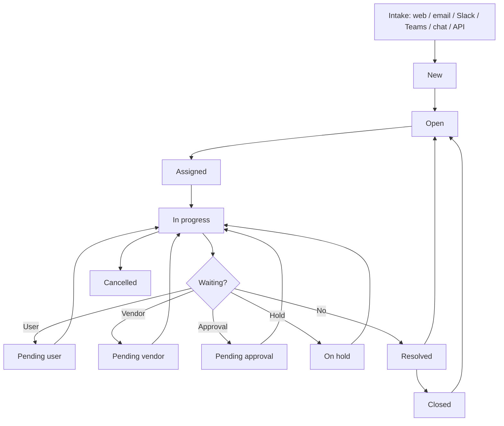
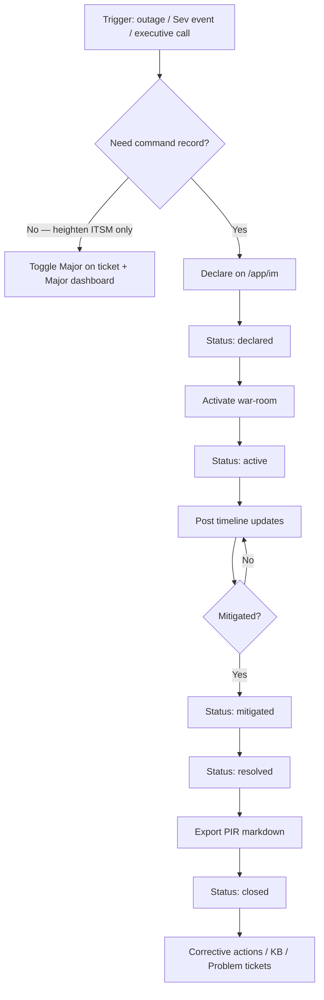
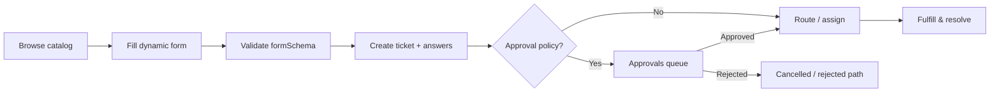
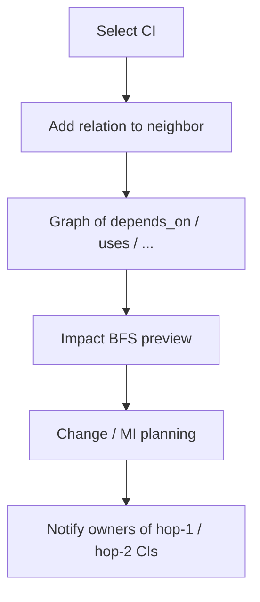
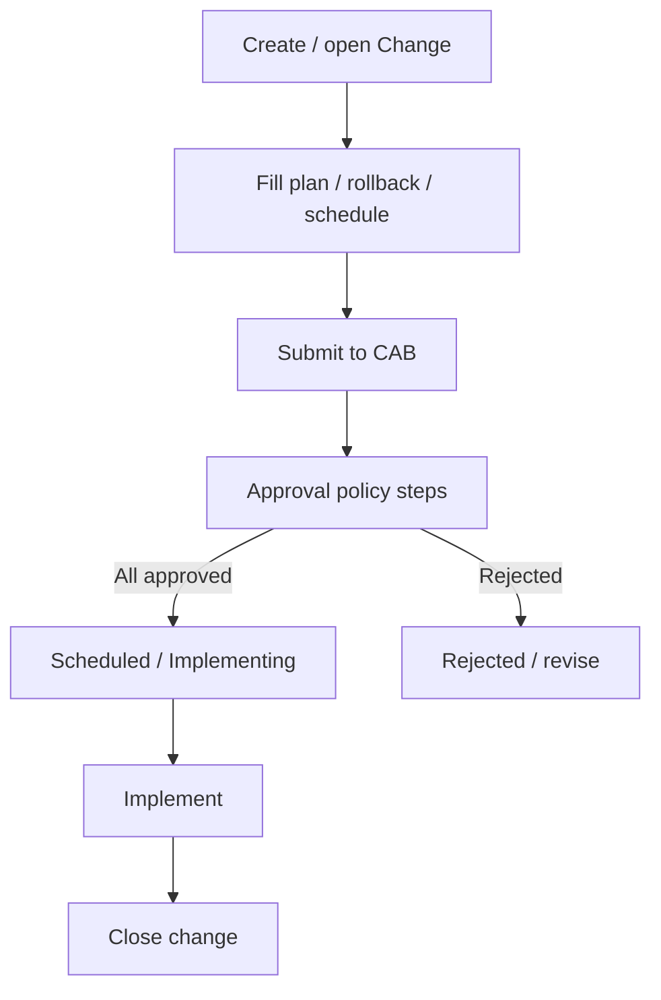

# Part III — Operations playbook

← [Setup](./02-setup-configuration.md) · [Book home](../USER_AND_DEVELOPER_GUIDE.md) · Next: [Developer guide](./04-developer-guide.md)

This part is the **how-to book** for daily work. Each section: what it is → who → steps → flow → tips. Longer field manuals: [sops/](../sops/README.md).

---

## 11. Tickets, queue & major incidents

### What it is

The core case record for incidents, service/access requests, security incidents, problems, changes, and tasks. Staff work them from **Tickets** (list) or **Queue** (Kanban + workload).

### Who

| Role | Typical actions |
| --- | --- |
| Employee | Create, comment, track own |
| Agent+ | Triage, assign, internal notes, resolve |
| Manager | Oversight, MI, soft-delete |

### Employee — create a ticket

1. **Tickets** → create (or Home shortcut).
2. Choose type, title, description, category, impact/urgency, origin site.
3. Optional: AI classify / related KB suggestions before submit.
4. Attach files if needed; submit.
5. Track status; reply on the public thread.

Employee SOP: [SOP-08](../sops/08-employee-self-service.md).

### Agent — work a ticket

1. Open **Home** → **Queue board** / KPI cards, or go directly to `/app/queue`; check notification bell.
2. On **Tickets**, use **Search** for ticket number (e.g. `INC-2026-…`), title keywords, or requester name/email (`GET /tickets?q=`).
3. Claim / assign / change status from detail or Kanban.
4. Triage: type, category, origin site, priority, assignment.
5. Public reply vs **internal note**; **Watch** if needed; **Work logs** for time.
6. Link assets; set pending_* when waiting (may pause SLA).
7. Resolve with a clear public summary → Close after confirmation/policy.
8. On conflict (“modified by someone else”), reload and re-apply (`version` lock).

Agent SOP: [SOP-09](../sops/09-agent-ticket-handling.md).

### Ticket lifecycle flow

### Major incidents (ITSM flag)

1. Toggle **Major incident** on ticket detail (badge + list/queue filter).
2. Ops view: `/app/major-incidents` — KPIs + related work cards.
3. Link related tickets; watch closely; prefer clear public status updates.

Use **Major** when a normal ITSM ticket needs heightened visibility. Use **IMS** (`/app/im`) when you need a dedicated command record, war-room timeline, named roles, and a PIR draft — see [§11A](#11a-incident-management-system-ims).

### Merge & relationships

- **Merge into this ticket** — sources become merged; comments/attachments copied with attribution.
- Parent/child links for related work without merge.

---

## 11A. Incident Management System (IMS)

### Why LogIt has IMS

Day-to-day ITSM tickets are optimized for **service desk volume**: many parallel cases, SLA clocks, assignment queues, and requester conversations.

**Major outages and business-critical events** need a different rhythm:

| ITSM ticket / Major flag | IMS command module |
| --- | --- |
| One case among many in the queue | Dedicated **command record** (`IM-YYYY-…`) |
| Agent triage + resolve | War-room **timeline**, severities SEV1–SEV4 |
| Optional “major” badge | Explicit **status workflow** (declared → closed) |
| Comments for requester | Stakeholder vs **internal** updates |
| Resolve notes | **PIR markdown export** from the timeline |
| `/app/major-incidents` aggregates tickets | `/app/im` is the command board |

LogIt keeps both: **Major** stays for ITSM escalation; **IMS** is the command & control surface when leadership needs a single source of truth for “what is happening right now” and “what we will write in the post-incident review.”

### Who can use it

| Permission | Typical use |
| --- | --- |
| `im:read` | See board + detail; export PIR |
| `im:write` | Declare incidents, post updates, change status |
| `im:command` | Assign command roles (API; with `im:write`) |
| `im:postmortem` | PIR access (also allowed via `im:read` today) |

**Seeded:** `sysadmin` (all) and `it_manager` (all four `im:*`). Agents do **not** see **IM** in nav until an admin grants `im:read` (and usually `im:write`) under **Roles & Access**.

Field SOP: [SOP-21 Incident Management](../sops/21-incident-management.md).

### What ships today (UI)

| Surface | What you can do |
| --- | --- |
| `/app/im` board | List recent IM incidents; **Declare** (title, severity, summary) |
| `/app/im/[number]` detail | Status dropdown, timeline, post public/internal updates, **Export PIR** (.md), linked ITSM ticket if any |
| Top nav **IM** | Shown when session has `im:read` |
| Reports | “IMS / ops KPIs” strip — **ticket/SLA-derived** ops metrics (not `ImIncident` counts) |

### How it works (workflow)

**Status meanings**

| Status | Intent |
| --- | --- |
| `declared` | Command record opened; assembling people |
| `active` | Incident under active response |
| `mitigated` | Customer impact reduced; cleanup / RCA in progress |
| `resolved` | Service restored; PIR drafting |
| `closed` | Command closed; follow-ups live elsewhere |

Changing status (writers) also appends a timeline line (`Status → …`) and sets `resolvedAt` when moving to resolved/closed.

### Declare an incident

1. Sign in as a user with `im:write` (e.g. manager / admin).
2. Open **IM** → fill **Title**, **Severity** (SEV1–SEV4), optional **Summary**.
3. **Declare** → you land on the detail page (`IM-…` number).
4. Optionally link an existing ITSM ticket via API (`ticketId` on create) — UI declare form does not yet expose ticket/commander pickers.

### Run the war-room

1. Keep **Status** current (declared → active → mitigated → resolved → closed).
2. Post **updates** on the timeline; check **Internal only** for scribe notes that should not appear in the public PIR section.
3. Roles (`commander`, `scribe`, `comms`, `responder`) can be assigned via `POST /api/v1/im/:id/roles` — listed read-only on the detail page today (assignment UI pending).
4. When ready, **Export PIR** downloads a markdown draft with summary placeholders, roles, public + internal timelines, and PIR section stubs (impact, root cause, actions, lessons).

### IMS vs monitoring ingest vs automation

These companion capabilities support incident ops but are **not** full Admin screens yet:

| Capability | Built? | Visible in Admin UI? | Notes |
| --- | --- | --- | --- |
| IM permissions | Yes | **Yes** — Roles & Access extras / IT Manager role | Grant `im:*` here |
| Declare / timeline / PIR | Yes | **Yes** — `/app/im` | Primary IMS UI |
| Assign IM roles | API yes | **No** detail form yet | `POST /im/:id/roles` |
| Link ticket / commander on create | API yes | **No** on declare form | Use API or follow-up UI |
| Automation rules (ticket on-create) | API yes | **No** Admin page | `GET/POST/PATCH /automation/rules` needs `settings:manage` |
| Monitoring alert ingest | API yes | **No** Integrations page | `MONITORING_INGEST_SECRET` + `POST /integrations/monitoring/alerts` creates an **ITSM ticket**, not an `ImIncident` |
| Dedicated IMS admin (severities, templates) | No | — | Roadmap |

### Tips

- Start IMS early for SEV1/SEV2 — do not wait until the ticket thread is unreadable.
- Keep public timeline updates short and stakeholder-friendly; put speculation in internal notes.
- After PIR export, create Problem / Change tickets for lasting fixes; closing IM does not auto-close linked ITSM work.
- Re-login after granting `im:*` so the session nav picks up **IM**.

---

## 12. Service catalog & requests

### What it is

Published offerings (e.g. laptop request, access package) with optional **dynamic forms** (`formSchema`). Submitting creates a structured ticket with persisted answers.

### Who

Everyone can browse (per nav). Fulfillment = agents/approvers depending on policy.

### How-to (requester)

1. Open **Catalog**.
2. Pick an item; complete required fields.
3. Submit → land on the created ticket.
4. If approval is required, status moves toward pending approval; watch notifications.

### Flow

Catalog SOP: [SOP-13](../sops/13-knowledge-and-catalog.md).

---

## 13. Knowledge base & deflection

### What it is

Searchable articles (rich HTML). Views + helpful / not helpful / “solved my issue” feed **deflection analytics** on Reports.

### Who

| Action | Permission |
| --- | --- |
| Read | `knowledge:read` |
| Create/edit | `knowledge:write` |

### How-to

**Reader:** Knowledge → open article → use feedback buttons if the article helped (or didn’t).

**Author:** Knowledge → New / Edit → publish clear title, category tags, steps. Prefer articles that answer the top ticket categories.

**Analyst:** Reports → deflection panel — views, helpful rates, solved events.

Tip: Put KB search **before** ticket create in training — deflection only works if people look first.

---

## 14. Assets / CMDB

### What it is

IT asset / CI register: tag, type, status, assignee, location, serial/manufacturer/model, warranty; **relationships** for impact analysis; **discovery CSV** import.

Statuses: `in_stock` · `in_service` · `in_repair` · `retired` · `disposed`.

Relation types: depends_on, runs_on, hosted_by, connected_to, uses, backs_up, member_of.

### Who

Read: `assets:read`. Write: `assets:write`.

### How-to

1. **Assets** — select a row → edit detail panel → **Save** / **Retire**.
2. **Relationships** — pick related asset + type → **Add link**; remove with trash.
3. Review **Impact preview** (BFS hops) before changes/outages.
4. Link assets on ticket detail when hardware is involved.
5. Import discovery CSV when bulk-loading CIs / relations.

### Relationship / impact flow

Assets SOP: [SOP-14](../sops/14-assets.md).

---

## 15. Approvals & CAB

### What it is

Multi-step **approval policies** (sequential steps). Used for access/service requests and **Change → Submit to CAB**.

### Who

| Action | Permission |
| --- | --- |
| View queue | `approvals:read` |
| Approve/reject | `approvals:decide` |
| Configure policies | `settings:manage` |

### How-to (approver)

1. Open **Approvals**.
2. Review request context / linked ticket.
3. Approve or reject with a comment.
4. Next step unlocks until policy completes; ticket advances (e.g. change → Scheduled).

### CAB flow

---

## 16. SLA, routing & assignment

### What it is

- **SLA policies** attach targets (first response / resolve); worker ticks instances; escalations notify.
- **Assignment rules** match category/location → team; optional **auto-assign** least-open agent filtered by **skills**.
- Pending statuses can **pause** clocks when configured.

### Who configures

Admins / managers with `settings:manage` or `org:manage` → **Routing & SLA**.

### Agent tips

- First non-requester response should satisfy first-response SLA.
- Wrong queue? Reassign and leave a note.
- Watch bell for SLA warnings.

Detail: [SOP-12](../sops/12-sla-and-escalations.md).

---

## 17. Problems & changes

### Problems (`/app/problems`)

- Raise from an incident (**Raise problem**) or create dedicated PRB.
- Statuses oriented to investigation / known error.
- Link related incidents; capture RCA fields.

### Changes (`/app/changes`)

- Capture plan, rollback, schedule windows.
- **Submit to CAB** → Approvals → scheduled implementation.
- Coordinate with Assets impact preview for CI-touching changes.

Manager view: [SOP-10](../sops/10-manager-operations.md) · Change SOP: [SOP-20](../sops/20-change-and-release.md) (release process; product change UI as above).

---

## 18. Reports, audit & notifications

### Reports (`/app/reports`)

- Summary KPIs (open, unassigned, breaches, by location, etc.)
- Heatmap (day-of-week × hour)
- Stage bottlenecks / stuck list
- CSV / PDF export
- Scheduled email exports (when SMTP + schedules enabled)
- Knowledge deflection panel

### Audit (`/app/audit`)

- Filtered trail of sensitive/business events
- CSV export
- **Immutable export schedules** — emailed CSV with **SHA-256** run history (L5)

### Notifications

- Bell + `/app/notifications` inbox
- Profile: digest daily/weekly, quiet hours
- Watchers get comment/status fan-out

SOPs: [SOP-15](../sops/15-attachments-and-audit.md), [SOP-16](../sops/16-notifications.md), [NOTIFICATIONS.md](../NOTIFICATIONS.md).

---

## 19. Integrations

### Email

- Outbound SMTP for notifications/digests/exports
- Inbound + **IMAP UNSEEN** poller creates/comments tickets with threading (Message-ID / In-Reply-To)
- Tickets stamped `channel=email`

### Slack / Teams

- Signed intake (Slack HMAC; Teams Bot Framework JWT + shared-secret fallback)
- Channel stamp + deep links via `APP_PUBLIC_URL`

### Outbound webhooks

- HMAC-signed endpoints configured in Admin → Integrations
- Delivery log; rotate secrets
- **Note:** deliveries are logged; automatic retry worker is polish/backlog

Admin hub: `/app/admin/integrations`. Docs: email / Slack-Teams / webhooks under `docs/`.

---

## 20. Quick reference by role

### Employee

| Task | Where |
| --- | --- |
| Get help without a ticket | Knowledge |
| Request a service | Catalog |
| Report an issue | Tickets → create |
| Track / reply | My tickets |
| MFA / digests | Profile |

### Agent

| Task | Where |
| --- | --- |
| Board + workload | **Home** → Queue cards / `/app/queue` |
| Triage list | Tickets |
| Command / Sev incident | **IM** (`/app/im`) — needs `im:*` |
| P1 ops (ITSM) | Major |
| Known errors | Problems |
| Planned work | Changes |
| Hardware context | Assets |
| Decisions waiting | Approvals |

### Approver

| Task | Where |
| --- | --- |
| Decide requests / CAB | Approvals |

### Manager / Admin

| Task | Where |
| --- | --- |
| People | Users, Roles & Access (grant `im:*` here) |
| Org | Locations, Departments, Teams |
| Policy | Routing & SLA, Approval policies |
| Incident command | **IM** |
| Look & feel | Branding |
| Channels | Integrations |
| Compliance | Audit, Reports |

### Auditor

| Task | Where |
| --- | --- |
| Evidence | Audit (+ scheduled checksummed exports) |
| Trends | Reports |

---

← [Setup](./02-setup-configuration.md) · [Book home](../USER_AND_DEVELOPER_GUIDE.md) · Next: [Developer guide](./04-developer-guide.md)
