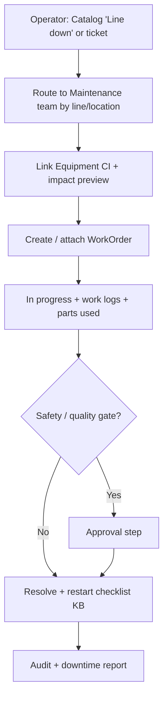
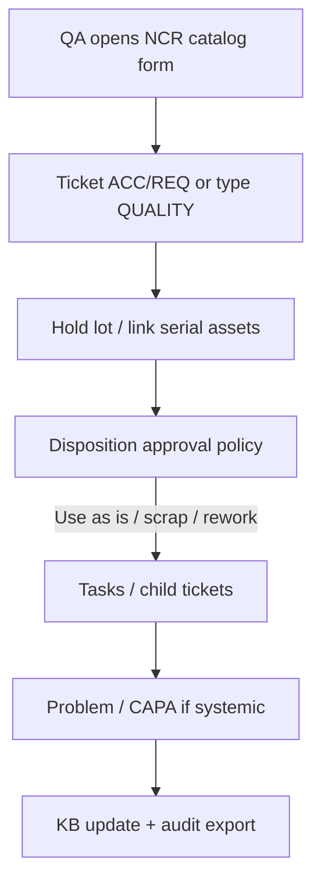
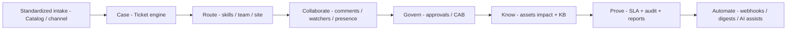

# Part V — Extending beyond ITSM

← [Developer guide](./04-developer-guide.md) · [Book home](../USER_AND_DEVELOPER_GUIDE.md)

> **Extension opportunity** — designs in this chapter are **not** shipped product features. They show how LogIt’s modular monolith can grow into a broader **business operations platform**, especially for manufacturing, while reusing tickets, catalog, assets/CMDB, approvals, SLA, knowledge, and audit.

---

## 26. Extension principles

LogIt already encodes a reusable spine:

| Spine capability | Business meaning outside IT |
| --- | --- |
| Ticket / case | Any work item with lifecycle, comments, attachments |
| Catalog + forms | Standardized request intake |
| Assets + relations + impact | Anything physical/logical with dependencies |
| Approvals | Gated decisions (spend, safety, quality, change) |
| SLA / routing / skills | Time-bound queues and specialist assignment |
| Knowledge | SOPs, work instructions, known errors |
| Audit + checksummed exports | Regulated evidence |
| Reports / heatmaps | Operational analytics |
| Integrations / webhooks | ERP, MES, SCADA alerts, email, chat |

### Where to extend (code map)

| Layer | Add… |
| --- | --- |
| `packages/shared` | New permission codes, status enums, type prefixes |
| `apps/api/prisma/schema.prisma` | Models + migrations |
| `apps/api/src/<module>` | Nest module, service, controller, DTOs, guards |
| `apps/web/src/app/app/...` | Pages + CSS modules |
| `apps/web/src/lib/access.ts` | Nav + capability helpers |
| Seed | Demo data for new domain |
| Docs | SOP + update this guide |

### Design rules

1. **Reuse before inventing** — prefer a ticket *type* + custom fields / linked domain table over a parallel case engine.
2. **Permissions first** — every new write path needs a permission code and role grants.
3. **Audit meaningful state changes** — especially safety, quality, and financial approvals.
4. **Keep PostgreSQL authoritative** — don’t put business truth only in Redis or files.
5. **Nav by persona** — operators should not drown in IT-only labels; use domain language in UI copy even if the engine is shared.
6. **Mark product vs extension** in docs so sales/ops don’t assume screens exist.

### Suggested extension pattern (blueprint)

```text
1. Domain nouns (e.g. WorkOrder, Nonconformance, Equipment)
2. Decide: subtype of Ticket vs first-class model linked to Ticket
3. Permissions (e.g. quality:write, maintenance:assign)
4. Prisma models + Ticket link / Catalog item for intake
5. API module with SessionAuthGuard + @Permissions
6. Web pages + nav group (“Plant ops”)
7. SLA policies / approval policies for the new flows
8. Webhooks to ERP/MES; knowledge for SOPs
9. Reports + audit events
10. Seed + SOP chapter
```

---

## 27. Manufacturing operations blueprint

### Target picture

A discrete or process manufacturer wants **one operational backbone** for:

- Production-blocking incidents and line stops  
- Maintenance work orders on equipment  
- Quality nonconformances (NCR) and CAPA-style follow-ups  
- Supplier / inbound quality issues  
- Controlled process/document changes  
- Spare parts and tooling as CIs  
- Shift handoff knowledge  

LogIt today already covers the IT-shaped versions of these. The extension is mostly **domain modeling + UX labeling + integrations**.

### Mapping: manufacturing need → LogIt spine

| Manufacturing need | Use today (current) | Extend with (opportunity) |
| --- | --- | --- |
| Line-down / IT on plant floor | Incident ticket + MI + assets | Plant “Major” queue; equipment CI class; on-call skills |
| Corrective maintenance | Ticket + asset link | `WorkOrder` model or CHG/TSK subtype; downtime fields; spare parts used |
| Preventive maintenance | Catalog request / scheduled change | PM schedules → auto catalog/ticket; meter/time triggers via worker |
| Quality NCR | Ticket type + attachments | `Nonconformance` linked to lot/serial; disposition approvals |
| CAPA | Problem + knowledge | CAPA workflow statuses; effectiveness check task |
| Supplier issue | Ticket + vendor pending | Supplier CI; scorecard report; webhook to ERP PO |
| Process change | Change + CAB | Manufacturing CAB policy; document revision gate |
| Spare parts / tooling | Assets + relations | Part numbers, min/max qty; `uses`/`depends_on` to equipment |
| Work instructions | Knowledge | Controlled docs + acknowledgment; deflection = fewer tribal questions |
| Shift handoff | Comments / watchers | Handoff note template; digest per line/team |
| Compliance evidence | Audit exports | Domain events in audit; signed export schedules |

### Example domain model (extension)

```text
Equipment (extends Asset or AssetType=EQUIPMENT)
  └─ AssetRelation → Line, PLC, Sensor, SparePart

WorkOrder
  id, number (WO-####), ticketId?, equipmentId
  type: corrective|preventive|calibration
  downtimeMinutes, productionLossEstimate
  status (mirrors or links Ticket status)

Nonconformance
  id, number (NCR-####), ticketId?
  lotOrSerial, defectCode, quantity
  disposition: rework|scrap|use_as_is|return
  approvalPolicyId

ProductionLine (Location or Asset member_of hierarchy)
```

**Recommendation:** Keep **Ticket** as the collaboration/SLA surface; store manufacturing-specific fields on linked tables (`WorkOrder`, `Nonconformance`) with `ticketId` FK. That preserves queue, notifications, approvals, and audit with minimal fork.

### Manufacturing flows

#### A. Line-down → maintenance work order



**How to implement**

1. Catalog item “Report line stop” with formSchema: line, equipment tag, safety risk, symptoms.  
2. Assignment rule: location/line → Maintenance team; skill `mechanical` / `electrical`.  
3. Asset types for equipment; relations to upstream/downstream line CIs.  
4. Optional `WorkOrder` table + panel on ticket detail.  
5. SLA policy: P1 line-down response 15m.  
6. Webhook `ticket.resolved` → MES/OEE system.

#### B. Quality nonconformance



**How to implement**

1. New permission `quality:write` / `quality:decide` (or reuse approvals).  
2. `Nonconformance` model + Approvals policy “NCR disposition”.  
3. Reports: defects by code, line, supplier.  
4. Knowledge: work instructions + known error articles for recurrent defects.

#### C. Process / document controlled change

Reuse **Changes + CAB + Approvals** with a manufacturing approval policy (Quality + Production + EHS). Attach controlled document version in knowledge or external PLM link via webhook.

#### D. Spare parts as CMDB

Model parts as assets (`in_stock` / `in_service`); `uses` / `depends_on` to equipment; discovery CSV for initial load; ticket links when parts are consumed (work log note or future `PartConsumption` table).

### Plant org setup (using current admin)

| LogIt admin object | Manufacturing use |
| --- | --- |
| Locations | Plants / buildings / lines as sites |
| Departments | Production, Maintenance, Quality, EHS, Warehouse |
| Teams | Line 1 Response, Reliability, Incoming QC |
| Skills | PLC, CNC, Welding, Metrology |
| Roles | Map supervisors → `it_manager`-like oversight; technicians → `agent`; QA disposition → `approver` |

You may later rename role **display names** for plant language while keeping codes stable — or add roles `maintenance_tech`, `quality_engineer` in shared + seed (**extension**).

### Integration sketch (extension)

| System | Direction | Mechanism |
| --- | --- | --- |
| MES / SCADA alarms | In → LogIt | Inbound webhook / email → ticket |
| ERP (SAP/Odoo) | Bi-di | Outbound HMAC webhooks + API |
| CMMS legacy | Out | Webhook on work order status |
| SSO | In | Existing Entra OIDC |
| Document control | Out/In | Knowledge + links; future PLM connector |

---

## 28. Other industry scenarios

Same spine, different nouns. All **extension opportunities**.

### 1. Facilities & workplace services

| Need | Pattern |
| --- | --- |
| Hot/cold calls, access badges, moves | Catalog + tickets |
| Buildings / rooms / HVAC | Assets + relations |
| Vendor SLAs | SLA policies + pending_vendor |
| After-hours | Routing rules + on-call skills |

### 2. Retail / multi-store operations

| Need | Pattern |
| --- | --- |
| Store incidents (POS, fridge, shrink) | Tickets + origin **location** = store |
| Planogram / equipment | Assets per store |
| Regional approvals for refunds/write-offs | Approval policies |
| Heatmap by hour | Existing reports heatmap |
| Chat from store managers | Slack/Teams intake |

### 3. Healthcare clinical engineering (IT + biomed)

| Need | Pattern |
| --- | --- |
| Device repair | Assets (UDI/serial) + tickets |
| Patient-safety major events | MI dashboard + strict audit |
| Clinical change control | Change + CAB |
| Competency | Skills on technicians |
| Evidence | Immutable audit export schedules |

> Privacy: extend with stricter field-level controls and retention policies before PHI-heavy use.

### 4. Professional services / project intake

| Need | Pattern |
| --- | --- |
| Client requests | Catalog forms |
| Delivery tasks | Child tickets / TASK type |
| Approvals for scope/budget | Multi-step approvals |
| Knowledge | Playbooks per service line |
| Time | Work logs → future billing export webhook |

### 5. Logistics / fleet

| Need | Pattern |
| --- | --- |
| Vehicle / trailer CIs | Assets + `connected_to` |
| Breakdown / delay cases | Tickets + MI for network disruption |
| Driver reports | Mobile web + email intake |
| Compliance checks | Approvals + audit |
| Yard locations | Locations hierarchy |

### Cross-scenario flow (generic case platform)



---

## 29. Anti-patterns & boundaries

| Anti-pattern | Why it hurts | Prefer |
| --- | --- | --- |
| Second “ticket” table with its own comments/SLA | Duplicates years of work | Link domain row → `Ticket` |
| Permissions only in React | Security holes | Nest guards + shared codes |
| Hard-coding plant lines in UI | Can’t onboard next factory | Locations / assets / metadata |
| Storing evidence only in email | Not auditable | Audit log + export schedules |
| Putting MES truth only in Redis | Loss on restart | Postgres |
| One giant `misc JSON` blob for all industries | Unqueryable mess | Explicit columns/tables per domain |
| Ignoring uploads durability on PaaS | Lost attachments | Volume / object storage |
| Renaming IT concepts without training | Confused users | Domain labels in UI + SOP glossary |
| Building manufacturing ERP inside LogIt | Scope explosion | Integrate via webhooks/API; own the **case & control** plane |

### What LogIt should remain good at

Even when extended, keep the product centered on:

1. **Intake & workflow** for operational cases  
2. **Accountability** (assign, SLA, approve, audit)  
3. **Context** (CI relationships, knowledge, channel history)  
4. **Integration hub** — not a replacement for MES/ERP/PLM

---

## Closing

LogIt today is a **complete modular ITSM platform through L5**. The same architecture is a credible **operations case platform** for manufacturing and other industries — if you extend with discipline: shared ticket spine, explicit domain tables, permissions, audit, and clear docs that separate **shipped** from **planned**.

When you add a domain module, update:

- This Part V (what became current product)  
- [GAP_ASSESSMENT.md](../GAP_ASSESSMENT.md) / [DEVELOPMENT_TODO.md](../DEVELOPMENT_TODO.md)  
- A new SOP under `docs/sops/`  
- Seed + permissions in `@logit/shared`

---

← [Developer guide](./04-developer-guide.md) · [Book home](../USER_AND_DEVELOPER_GUIDE.md)
